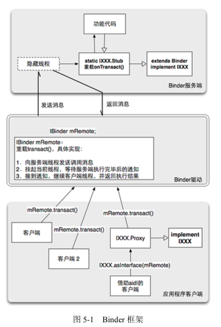

Binder
===
---
Binder是一种架构，这种架构提供了`服务端接口`,`Binder驱动`,`客户端`三个模块,如下所示：

## 1. 服务端接口
---
> 一个Binder服务端实际上就是一个Binder类的对象，该对象一旦创建，内部就启动一个隐藏线程，该线程接下来会接收Binder驱动发送的消息，收到此消息后，会执行到Binder对象中的`onTransact()`函数，并按照该函数的参数执行不同的服务代码，因此，要实现一个Binder服务，就必须重载`onTransact()`

> 可以想象,重载 `onTransact()`函数的主要内容是把 `onTransact()`函数的参数转换为服务函数的参数, 而 `onTransact()`函数的参数来源是客户端调用 `transact()`函数时输入的,因此,如果 `transact()`有固定格式 的输入,那么 `onTransact()`就会有固定格式的输出。

## 2. Binder驱动
---
> 任意一个服务端Binder对象被创建时，同时会在Binder驱动中创建一个mRemote对象，该对象的类型也是Binder类。客户端要访问远程服务时，都是通过mRemote对象。

### 3. 客户端
> 客户端要想访问远程服务，必须获取远程服务在Binder对象中对应的mRemote引用，获取后就可以调用其`transact()`方法，而在Binder驱动中，mRemote对象也重载了transact()方法，重载的内容主要包括以下几项：
> 
* 以线程间消息通信的模式，向服务端发送客户端传递过来的参数。
* 挂起当前线程，当前线程正是客户端线程，并等待服务端线程执行完指定服务器函数后通知(notify).
* 接收到服务端线程的通知，然后继续执行客户端线程，并返回到客户端的代码区。

	从这里可以看出，对应用程序开发者而言，客户端似乎是直接调用远程服务对应的Binder，而事实上则是通过Binder驱动进行了中转。即存在两个Binder对象，一个是服务端的Binder对象，另一个是Binder驱动中的Binder对象，所不同的是Binder驱动中的对象不会再额外产生一个线程。