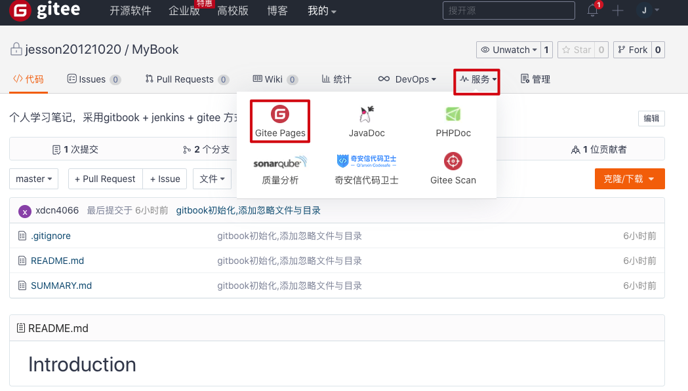

# GitBook 基本使用 #


<!-- vim-markdown-toc GitLab -->

* [起因](#起因)
* [安装](#安装)
* [书籍创建](#书籍创建)
* [书籍预览](#书籍预览)
* [书籍保存](#书籍保存)
	* [1. 创建书籍仓库](#1-创建书籍仓库)
	* [2. 上传书籍](#2-上传书籍)
* [书籍部署](#书籍部署)
	* [1. 创建page分支](#1-创建page分支)
	* [2. 书籍编译](#2-书籍编译)
	* [3. 发布书籍](#3-发布书籍)
	* [3. 开启page功能](#3-开启page功能)
	* [4. 访问书籍网页](#4-访问书籍网页)
* [FAQ](#faq)

<!-- vim-markdown-toc -->

## 起因 ##
由于自己平时记录的学习笔记的比较零散, 没有系统的整理，不方便查看搜索, 所以这里采用`GitBook`来记录。

## 安装 ##
gitbook 的安装非常简单，详细指南可以参考 [gitbook](https://github.com/GitbookIO/gitbook)官方文档。
```shell
npm install gitbook-cli -g
```
> 需要注意的是：用户首先需要安装 nodejs，以便能够使用 npm 来安装 gitbook。

## 书籍创建 ##
选择一个空目录`MyBook`, 并执行以下指令即可初始化一本书
```shell
cd MyBook
git init
gitbook init
```
创建完成后的目录结构如下
```shell
jessons-Mac:MyBook jesson$ tree
.
├── README.md
└── SUMMARY.md

0 directories, 2 files
```

## 书籍预览 ##
使用`gitbook serve`指令，编译书籍，并开启web服务
```shell
jessons-Mac:MyBook jesson$ gitbook serve
Live reload server started on port: 35729
Press CTRL+C to quit ...

info: 7 plugins are installed 
info: loading plugin "livereload"... OK 
info: loading plugin "highlight"... OK 
info: loading plugin "search"... OK 
info: loading plugin "lunr"... OK 
info: loading plugin "sharing"... OK 
info: loading plugin "fontsettings"... OK 
info: loading plugin "theme-default"... OK 
info: found 1 pages 
info: found 0 asset files 
info: >> generation finished with success in 0.2s ! 

Starting server ...
Serving book on http://localhost:4000
```

使用浏览器打开地址`http://localhost:4000`


> `gitbook serve` 指令会先调用`gitbook build` 指令，在当前目录生成`_book`目录，用于存储编译好的静态网页

## 书籍保存 ##
这里选择`Gitee`作为存储平台， 使用`Github`也是一样的。
### 1. 创建书籍仓库 ###


### 2. 上传书籍 ###
使用git将`MyBook`目录下的书籍上传到刚创建的`MyBook`仓库`master`分支中
```shell
git remote add origin https://gitee.com/jesson20121020/MyBook.git
git add .
git push origin master
```


## 书籍部署 ##
由于`GitBook`可以发布成静态网页，我们可以利用这个特性，方便的将我们的书籍部署到自己的服务器上，或者利用`github/gitee`的`page`功能,发布我们的书籍，方便自己和别人查看浏览。

### 1. 创建page分支 ###
```shell
git branch page
git checkout page
```
> 这里创建一个新的分支`page`来存储书籍的静态网页，其实也可以直接创建一个新的仓库来存储。

### 2. 书籍编译###
```shell
gitbook build
```
> 该指令会自动编译生成书籍的静态网页到_book目录下

### 3. 发布书籍 ###
```shell
git add .
git commit -m "上传生成的网页"
git push -u origin page
```

### 3. 开启page功能  ###
-   点击 `服务` -> `Gitee Page`


-   选择分支与目录

### 4. 访问书籍网页 ###


> 可以看到书籍成功部署到`gitee`网站中，可以随时使用各种平台浏览器访问了。


## FAQ ##

-   为啥选择Gitee

	其实首选是Github，毕竟用的习惯，但是无奈国内访问速度太慢
